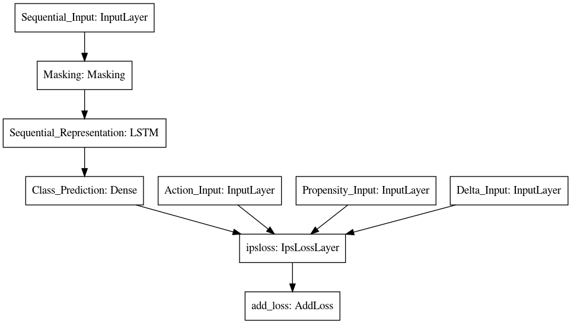

# etips

An implementation for the publication ["Learning Individualized Treatment Rules with Estimated Translated Inverse Propensity Score"](https://arxiv.org/abs/2007.01083) on ICHI2020 (8th IEEE International Conference on Healthcare Informatics) with `tf.keras` api.
# Project structure

```bash
.
├── bandit.py  # functions to generate dataset saved in the directory `data`
├── custom.py  # a custom tf.keras layer for etips
├── data  # generated datasets based on MNIST
├── Experiment_DM.py
├── Experiment_eIPS_etIPS.py
├── Experiment_IPS_tIPS.py
├── Experiment_PSE.py
├── Experiment_RP.py
├── Experiment_Supervised.py
├── LICENSE
├── lstm.py  # functions to build various lstm-based models
├── models  # directory to save trained models
├── README.md
├── requirements.txt
├── test_custom.py
├── test-requirements.txt
├── tuning.py  # hyperopt-based tuning functions
└── utils.py  # various helper functions
```


# Usage

* All `.py` files should be able to run with `python xxx.py` after installing the packages specified in `requirements.txt`.
* The `.py` scripts prefixed with `Experiment_` can be used to generate (similar) results in [Table I](https://arxiv.org/abs/2007.01083).
* The `IpsLossLayer` defined in `custom.py` enables the training by minimizing the estimated translated Inverse Propensity Score (etIPS). More details are in the [related paper](https://arxiv.org/abs/2007.01083).

During training, the model architecture looks as following.



Meanwhile, only part of the model is used during inference.


# Note

The code is published to improve the reproducibility in the machine learning community. If you use the code, please cite

```bib
@inproceedings{wu2020learning,
  title={Learning Individualized Treatment Rules with Estimated Translated Inverse Propensity Score},
  author={Wu, Zhiliang and Yang, Yinchong and Ma, Yunpu and Liu, Yushan and Zhao, Rui and Moor, Michael and Tresp, Volker},
  booktitle={2020 IEEE International Conference on Healthcare Informatics (ICHI)},
  pages={1--11},
  organization={IEEE}
}
}
```
