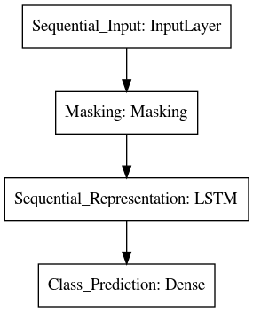

# etips

An implementation for the publication ["Learning Individualized Treatment Rules with Estimated Translated Inverse Propensity Score"](https://arxiv.org/abs/2007.01083) on ICHI2020 (8th IEEE International Conference on Healthcare Informatics) with `tf.keras` api.
# Project structure

```bash
.
├── bandit.py # functions to generate dataset as in the data directory
├── custom.py # a custom tf.keras layer for etips
├── data # datasets based on MNIST
├── Experiment_DM.py
├── Experiment_eIPS_etIPS.py
├── Experiment_IPS_tIPS.py
├── Experiment_PSE.py
├── Experiment_RP.py
├── Experiment_Supervised.py
├── LICENSE
├── lstm.py # functions to build various lstm-based models
├── models
├── README.md
├── requirements.txt
├── test_custom.py
├── test-requirements.txt
├── tuning.py # hyperopt-based tuning functions
└── utils.py # various helper functions
```

The repository offers scripts of experiments (prefixed with `Experiment_`) based on the [MNIST](http://yann.lecun.com/exdb/mnist/) dataset. I.e., they were used to generate results in Table I in the [paper](https://arxiv.org/abs/2007.01083).

# Usage

The `IpsLossLayer` defined in `custom.py` enables the training by minimiznig the estimated translated Inverse Propensity Score (etIPS). More details are in the [related paper](https://arxiv.org/abs/2007.01083).

During training, the model architecture looks as following.


Meanwhile, only part of the model is used during inference.



# Note

The code is published to improve the reproducibility in the machine learning community.
