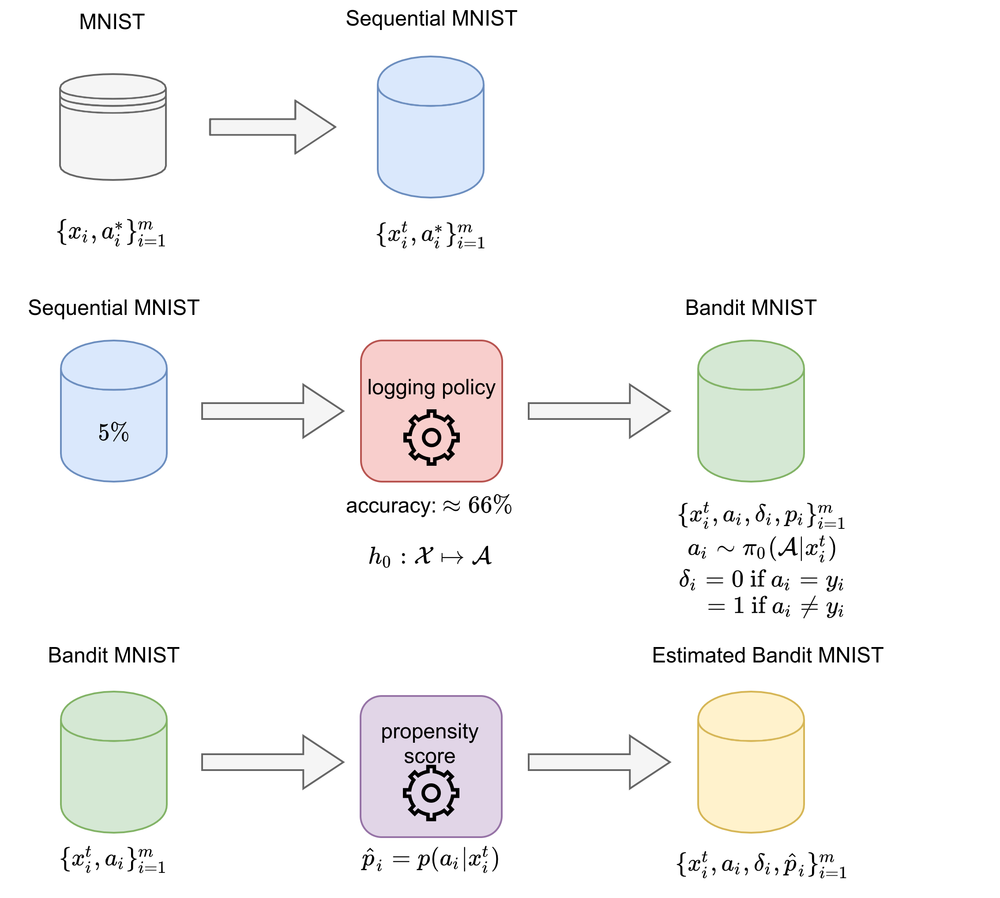

## Notation

* $x^t$: a sequence of $t$ (flattened) images, a.k.a. _context_ in the contexual bandit problem.
* $a^*$: ground-truth label for the sequential classification task. For zeros counting MNIST, the value is one of  `0, 1, 2`. For row-by-row MNIST, the value is one of `0, 1, ..., 9`.
* $a$: predicted label of a logging policy (a.k.a. _action_ in the contextual bandit problem).
* $\delta$: loss/risk of the predicted label, either `0` or `1`.
* $p$: probability of the predicted label $a$, a.k.a. the _propensity score_ in the contextual bandit problem.
* $\hat{p}$: estimated probability of the predicted label.

## Dataset description

* Three different types of datasets
    * Supervised learning dataset ($\{x_i^t, a_i^*\}^m_{i=1}$)
        * zeros counting MNIST: `Dataset_10k.pickle` generated by `data.py`
        * row-by-row MNIST: load with `tf.keras.datasets.mnist.load_data(path='mnist.npz')`
    * Bandit dataset ($\{x_i^t, (a_i^*), a_i, \delta_i, p_i\}^m_{i=1}$)
        * zeros counting MNIST: `Bandit_1.pickle` (from `bandit.py`)
        * row-by-row MNIST: `Bandit_2.pickle` (from `bandit.py`)
        * Note, $a_i^*$ in the dataset is not given as input for the training algorithm, but is only served to monitor the performance.
    * Estimated Bandit dataset ($\{x_i^t, (a_i^*), a_i, \delta_i, \hat{p}_i\}_{i=1}^m$)
        * zeros counting MNIST: `eBandit_1.pickle` (from `bandit.py`)
        * row-by-row MNIST: `eBandit_2.pickle` (from `bandit.py`)
        * Note: the setup $\{x^t_i, a_i, \delta_i\}_{i=1}^m$ fits the data situation in the medical use case.
* Codes for loading are in `../utils.py`

